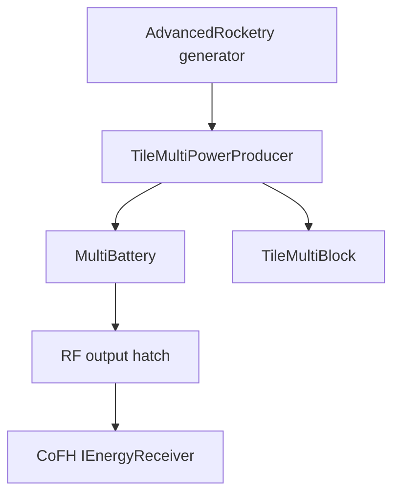

# Kerr Black Hole Backport：LibVulpes 支撑层实施规格

状态：Implementation-ready  
目标分支：`unstable1_7`  
审查基线：`59e9639207e93763b2661991ff09f8ef13fd5e19`  
配套仓库：`zerozaki666/AdvancedRocketry-Continuation`  
目标运行时：Minecraft 1.7.10、Forge `10.13.4.1614`、Java 8

## 1. 结论

LibVulpes 不拥有黑洞概念。本 backport 在 LibVulpes 中只补齐通用的端口刷新与卸载失效生命周期，并冻结 AdvancedRocketry 可以依赖的 multiblock、power、GUI、network 与 NBT 契约。

本仓库不得新增：

- `IBlackHolePowerProvider`
- `TileMachineBlackHole`
- 黑洞质量、自旋、吸积率或效率模型
- 黑洞专用 packet、GUI 或能源网络
- Forge Energy Capability、Tesla 或 Universal Electricity backport
- `long` 能量 API

黑洞天体、黑洞发电机、燃料规则、位置资格与 Kerr 渲染全部属于 AdvancedRocketry。

## 2. 审查依据

| 代码库 | 基线 | 结论 |
|---|---|---|
| `libVulpes-Continuation` | `unstable1_7@59e9639` | 已有多方块发电、RF 输出、toggle GUI、NBT 与 `PacketMachine` |
| upstream LibVulpes | `1.12@c2ca79dc18625c9e63a191a795f1f07d078f29f0` | 无任何 Black Hole 专用类；新增了 refreshing item-port getters |
| upstream AdvancedRocketry | `1.12@c5cd5af62fc07cd4e0d24f06a16033f181c47c04` | `TileBlackHoleGenerator` 直接继承 `TileMultiPowerProducer` |

上游 LibVulpes 与 AdvancedRocketry 的相关源码和资源为 MIT 来源；Continuation 仓库同时包含 AGPL-3.0 与历史 `LICENSE-MIT`。后续复制上游代码或资源时必须在提交说明或 provenance 文档中记录来源提交，不得删除既有许可文件。

## 3. 对初版方案的裁决

| 初版设想 | 裁决 | 技术原因 |
|---|---|---|
| 新增 `IBlackHolePowerProvider` | 删除 | 上游不存在；天体数据不应进入通用库；`long` 与现有 `int` 链不兼容 |
| 新增 `TileMachineBlackHole` | 删除 | 黑洞发电机是多方块 producer，正确基类是现有 `TileMultiPowerProducer` |
| 扩展 LibVulpes Power API | 改为复用 | `IUniversalEnergy`、`MultiBattery` 和 RF output hatch 已覆盖所需能力 |
| 声明 Universal Electricity 输出 | 删除 | 当前代码没有 UE 集成 |
| 声明 IC2 直接输出 | 删除 | IC2 适配是 input sink；发电机原生输出是 CoFH RF |
| 在 LibVulpes 计算质量、吸积率与效率 | 删除 | 这属于 AR 的玩法策略，且不是 1.12 原行为 |

## 4. 范围

### 4.1 必须实施

修改：

`src/main/java/zmaster587/libVulpes/tile/multiblock/TileMultiBlock.java`

以及：

`src/main/java/zmaster587/libVulpes/tile/energy/TilePlugBase.java`

加入：

```java
public List<IInventory> getItemInPorts();
public List<IInventory> getItemOutPorts();
```

两个方法来自上游 1.12 的通用 API。它们是 **best-effort refreshing accessors**，必须：

1. 按当前缓存列表顺序遍历；
2. 对实现了 `TileEntity` 的条目，先用 `worldObj.blockExists(x,y,z)` 确认端口 chunk 已加载；
3. 仅在 chunk 已加载时，使用其 `xCoord/yCoord/zCoord` 从 `worldObj` 重新查询；
4. 仅在新实例仍实现 `IInventory` 时替换缓存项；
5. 返回缓存列表本身；
6. 不加载区块、不创建 TileEntity、不修改 inventory 内容；
7. 在 `worldObj == null` 时安全返回现有缓存。

端口 chunk 未加载、查询结果缺失或不再是 `IInventory` 时，方法会保留原缓存引用；它不会验证 inventory 是否仍属于当前结构。因此调用者必须以服务端 `isComplete()`/结构校验为前提。返回值是内部可变列表，这是与上游一致的兼容行为；Javadoc 必须声明调用者只可读取/迭代，不得增删或长期持有列表。

`TilePlugBase` 必须像 `TileInventoryHatch#onChunkUnload()` 一样，在服务端卸载时通过 `getFinalPointedTile()` 找到 master，并对 `TileMultiBlock` 调用 `invalidateComponent(this)`。原因是 `MultiBattery` 持有 RF output TileEntity 的 transient 引用；仅刷新 item ports 无法处理 power-port chunk 单独卸载。

AR generator 同时承担配套生命周期：结构 incomplete 时每 20 ticks 做一次低频重试，但只有在结构覆盖的所有位置 `worldObj.blockExists(...)` 后才调用 `attemptCompleteStructure()`。这样 controller 先于相邻 chunk 加载时不会永久卡在首次失败，也不会为了检查结构强制加载 chunk。

### 4.2 不属于本次实施

- 修改 `IUniversalEnergy` 的签名或数值宽度；
- 让 `producePower` 改为返回接收量；
- 新增端口数量约束框架；
- 修改所有既有机器去调用新 getter；
- 为客户端 `ModulePower` 创建新的能量同步协议；
- 任何 AdvancedRocketry 类或资源。

## 5. 冻结的跨仓库契约

### 5.1 依赖方向



LibVulpes 不能反向依赖 AdvancedRocketry。

### 5.2 多方块契约

`TileMultiBlock` 的现有结构字符保持不变：

| 字符 | 含义 |
|---|---|
| `c` | controller |
| `I` | item input hatch |
| `O` | item output hatch |
| `p` | power output hatch |
| `P` | power input |
| `*` | 由具体机器定义的 wildcard |

当前 fork 已有字符级：

```java
public List<BlockMeta> getAllowableWildCardBlocks(Character wildCard);
```

AR 黑洞发电机必须覆盖这个签名。不要照抄 1.12 已废弃的无参 override。对 `'*'`，AR 可以加入：

- `TileMultiBlock.getMapping('I')`
- `LibVulpesBlocks.blockAdvStructureBlock`
- `TileMultiBlock.getMapping('p')`

其他字符必须委托 `super`。

成型及缓存生命周期保持现状：

1. `completeStructure()` 先调用 `resetCache()`；
2. 遍历结构并收集端口；
3. `TileMultiPowerProducer#integrateTile` 将 `'p'` 对应的 `IUniversalEnergy` 加入 `MultiBattery`；
4. 拆除结构时清空缓存；
5. 具体的 tickable producer 在首个服务端 tick执行 `attemptCompleteStructure()`；若相关 chunk 尚未全部加载，则按 20 ticks 低频重试；
6. power plug 单独卸载时由 `TilePlugBase#onChunkUnload()` 使 master invalid，避免继续使用旧 `MultiBattery` 引用。

`BlockMultiblockMachine#onBlockActivated` 已处理手动成型与 GUI。AR 初始化阶段仍必须显式调用：

```java
ItemProjector#registerMachine(
        new TileBlackHoleGenerator(), controllerBlock);
```

该 API 不会自动注册。

另外冻结一个现有不变量：注册到 `TileMultiBlock.getMapping('p')` 的每个 block，其 TileEntity 必须实现 `IUniversalEnergy`。`TileMultiPowerProducer#integrateTile()` 在 block 命中 mapping 后会直接 cast；违反该约束会产生 `ClassCastException`。

### 5.3 能量契约

能量流固定为：

1. AR 服务端计算本 tick 的实际非负 RF；
2. 将结果饱和转换到 `int`；
3. 必须先用 `getBatteries().acceptEnergy(requested, true)` 得到 `accepted`；
4. 调用 `TileMultiPowerProducer#producePower(accepted)`；
5. 将 `accepted` 作为同步和 GUI 中的实际 RF/t；
6. `MultiBattery#acceptEnergy` 依次填充所有输出口；
7. 每个 `TilePlugOutputRF` 向相邻 `cofh.api.energy.IEnergyReceiver` 推送 RF。

约束：

- 所有公开能量值都是 `int`；
- `MultiBattery` 是 transient aggregate，不写 NBT；
- 每个 output hatch 自己保存容量和能量；
- AR 必须拒绝 NaN、无穷、负倍率，并在传入 LV 前 clamp 到 `[0, Integer.MAX_VALUE]`；
- 不允许把负值传给 `UniversalBattery.acceptEnergy`，否则可能形成反向扣能；
- 多输出口只能分配同一份产能，不能让每个端口各复制一份；
- 本功能只承诺 CoFH RF 输出。

不得把 `IUniversalEnergy` 称为一个独立电网。它是 LibVulpes 内部能量适配接口；AR 自身的 energy pipe 最终同样通过 RF receiver 互操作。

### 5.4 NBT 所有权

| 状态 | 所有者 | 持久化方式 |
|---|---|---|
| `completeStructure`、`canRender` | `TileMultiBlock` | 现有 `writeToNBT/readFromNBT` |
| `enabled` | `TileMultiPowerProducer` | 现有 `writeNetworkData/readNetworkData` |
| output hatch 能量 | `TilePlugBase` | 每个端口自己的 NBT |
| input inventory | input hatch | inventory 自己的 NBT |
| `burnTicksRemaining` | AR generator | AR TileEntity NBT |
| 发电机运行状态和 RF/t | AR generator | AR 派生状态及客户端同步 |

AR 不得重复保存父类已经拥有的 `enabled`。上游 1.12 的 `last_usage` 未持久化是缺陷，不是兼容要求；AR 应保存相对剩余 tick。

物品消耗后的必要调用顺序为：

```java
ItemStack consumed = inventory.decrStackSize(slot, 1);
if (consumed != null && consumed.stackSize > 0) {
    // 先更新 controller 的 burnTicksRemaining
    inventory.markDirty();
    controller.markDirty();
}
```

只有消费成功才可启动/延长 burn；null/空返回必须当作失败。1.7 的 `TileInventoryHatch` 与 `EmbeddedInventory#decrStackSize` 不保证自动 `markDirty()`，遗漏会带来重载后燃料复制风险。此后每次实际发电并减少 `burnTicksRemaining` 时，AR 也必须再次 `controller.markDirty()`，不能只在首次投入物品时标脏。

### 5.5 GUI 与网络契约

父类已提供：

- `ModulePower`
- `ModuleToggleSwitch`
- modular inventory/container
- `PacketMachine`
- toggle 的 NBT 与网络处理

AR 仅追加状态文本。约定：

| PacketMachine ID | 所有者 | 内容 |
|---|---|---|
| `0` | 父类 toggle | `enabled` |
| `2` | AR generator | 状态码、实际 RF/t、量化后的可选燃烧进度 |

generator 必须定义显式 `PACKET_STATUS = 2`；避开 `TileMultiblockMachine.NetworkPackets.POWERERROR.ordinal() == 1` 的既有语义。AR override `writeDataToNetwork`、`readDataFromNetwork`、`useNetworkData` 时必须先调用 `super`。

状态和实际 RF/t 变化时立即广播；燃烧进度只按 5% bucket 或最多 1 Hz 同步。不得因为精确 `burnTicksRemaining` 每 tick变化而每 tick发包。也可以同步 burn start/total 让客户端本地倒计时，并做低频校正。

1.7 初始 TileEntity 同步使用：

- `S35PacketUpdateTileEntity`
- `getDescriptionPacket()`
- `onDataPacket(...)`
- `pkt.func_148857_g()`

不要移植 1.12 的 `getUpdateTag/handleUpdateTag`。

AR generator 的 `writeNetworkData/readNetworkData` 必须覆盖显式 state code、实际 RF/t 和 progress bucket，使继承的 description packet 在 chunk 初始加载时就包含完整 UI 状态。

客户端可能没有完整的 output-hatch cache，因此父类 `ModulePower` 可能短暂显示 `0/0`。发电机的状态文字以 AR 自己同步的实际 RF/t 为准，不能反过来从客户端 battery aggregate 推导玩法状态。

## 6. 1.12 到 1.7.10 的移植映射

| 1.12 写法 | 1.7.10 写法 |
|---|---|
| `ITickable#update()` | `TileEntity#updateEntity()`，并覆写 `canUpdate()` |
| `world`、`pos` | `worldObj`、`xCoord/yCoord/zCoord` |
| `BlockPos/IBlockState` | 坐标、`Block`、metadata |
| `EnumFacing` | `ForgeDirection` |
| `ItemStack.EMPTY/isEmpty()` | `null` 与 `stackSize` |
| `SPacketUpdateTileEntity` | `S35PacketUpdateTileEntity` |
| `pkt.getNbtCompound()` | `pkt.func_148857_g()` |
| `AxisAlignedBB.grow()` | `AxisAlignedBB.expand()` |
| 返回 compound 的 `writeToNBT` | `void writeToNBT(NBTTagCompound)` |
| `shouldHideBlock(World,BlockPos,IBlockState)` | `shouldHideBlock(World,int,int,int,Block)` |
| 已本地化的 machine name | `getMachineName()` 返回 i18n key，例如 `tile.blackholegenerator.name` |
| Forge Energy capability | CoFH RF API |

目标是 Java 8，但不得使用 Java 9+ API 或 1.12 的 registry/capability/data-fixer 机制。

## 7. 实施步骤

1. 在 `TileMultiBlock` 加入两个 best-effort refreshing item-port getters、`blockExists` guard 与 Javadoc。
2. 在 `TilePlugBase` 加入服务端 `onChunkUnload()` master invalidation。
3. 保持字段、旧方法和现有 ABI 不变。
4. 在完整 reload、power-port 单独卸载、placeholder 替换与结构重组场景验证缓存生命周期。
5. 构建并发布下一兼容版 LibVulpes。
6. AdvancedRocketry 的实现分支再提升 `libVulpesVersion` 或明确要求该构建。

如果 AdvancedRocketry 不提升最低 LibVulpes 版本，可以继续遍历 inherited protected `itemInPorts`；这不会阻塞 generator。若声明依赖本 hardening 版本，则应切换到 getter 并做联合重载测试。

## 8. 验收

### 8.1 构建与 API

- Java 8 下 `./gradlew clean build` 成功；
- universal 与 deobf artifacts 正常产生；
- 现有方法签名、字段可见性和 packet discriminator 不变；
- dedicated server 不加载任何新增 client class；
- getters 在 `worldObj == null`、空列表、非 TileEntity inventory 下不崩溃。

### 8.2 多方块与端口

- 一个 input、一个 RF output 的结构成型、GUI 和 projector 正常；
- 端口 chunk 已重新加载后，getter 刷新为当前坐标的 TileEntity；
- 端口 chunk 未加载时 getter 不强制加载，并明确保留 best-effort cached reference；
- RF plug 单独卸载会使 master incomplete，AR 在相关 chunks 加载后低频重组；
- 拆除再重组不会重复挂接同一 output；
- 跨 chunk 边界的端口重载不产生 `ClassCastException`；
- 无 `I` 时 `getItemInPorts()` 为空；无 `O` 时 `getItemOutPorts()` 为空；
- 无 `p` 时 `getBatteries()` 容量为 0，AR 不消费新燃料；
- 所有 `'p'` mapping 的 TileEntity 都实现 `IUniversalEnergy`；
- 调用 getter 不强制加载未加载区块。

### 8.3 联合集成

- 一个和多个 output hatch 都能接收同一份总 RF；
- 相邻 Thermal Expansion/CoFH receiver 与 AR energy pipe 正常收能；
- 带 IC2 的整合包能启动，但不宣称 IC2 直接输出；
- toggle、重登、保存退出后 `enabled` 保持；
- output full 时由 AR 阻止新燃料消费；
- input 消耗、chunk reload 和服务器重启不复制物品。
- 燃烧中保存退出、controller chunk unload/reload、服务器重启后，`burnTicksRemaining` 按“卸载暂停”语义精确恢复且不重复耗料。

## 9. 风险与缓解

| 优先级 | 风险 | 缓解 |
|---|---|---|
| P0 | 燃料消耗后未 mark dirty，重载复制 | AR 明确标脏 hatch 与 controller |
| P0 | 上游 `last_usage` 未持久化，重启后丢失/免费燃烧 | AR 保存相对 `burnTicksRemaining` 并做重载测试 |
| P0 | 负功率进入 battery API | AR 配置校验并饱和转换 |
| P1 | item-port 与 `MultiBattery` 都是 transient | refreshing getter；plug unload invalidation；AR loaded-chunk 低频重组 |
| P1 | `int` 累加或倍率溢出 | AR 使用宽类型计算后 clamp |
| P1 | 将 IC2/UE 误当原生输出 | 文档与验收只承诺 RF |
| P2 | getter 暴露可变内部列表 | Javadoc 要求 read-only 使用 |
| P2 | 客户端 `ModulePower` 为 `0/0` | AR 状态包提供权威 RF/t 文本 |

## 10. Definition of Done

- 仅新增通用 item-port refreshing accessors 与 power-plug unload invalidation，没有黑洞专用 LibVulpes API；
- getters 在端口 chunk 已加载后刷新实际 TileEntity，且不强制加载 chunk；
- RF plug 单独卸载会使 master 失效，AR 能在 chunks 就绪后重组；
- 现有 multiblock、power、GUI、packet 与 NBT 行为无回归；
- Java 8/Forge 1.7.10 构建通过；
- AdvancedRocketry 联合测试覆盖 input/output、重载、拆装、RF 与 dedicated server；
- 代码/资源来源及许可证记录完整。
